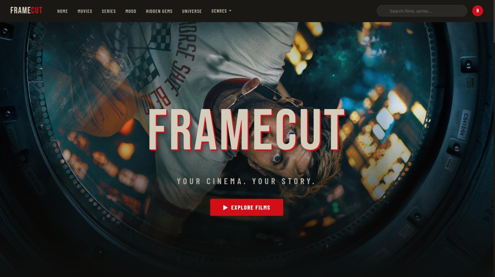

<h1 align="center">🎬 FrameCut: Your Cinema, Your Story</h1>

**[FrameCut](https://framecut-kmem.onrender.com/)**

Welcome to **FrameCut**, a premium, full-stack movie and TV series discovery platform designed for true cinephiles. Inspired by platforms like Letterboxd and IMDb, FrameCut goes beyond simple databases to offer a personalized, visually stunning experience for exploring cinema.

Whether you're tracking your watch history, diving into the filmography of legendary directors, or trying to find the perfect movie for your current mood, FrameCut is your ultimate cinematic companion.

---

## 🍿 Core Features

### 📖 Personalized Watchlists & Reviews
Keep track of everything you watch. Rate films out of 5 stars, write detailed reviews to share your thoughts, and build a curated watchlist of titles you want to see next. Your profile acts as your personal cinema diary.

### 🌌 The Cinematic Universe
Go beyond the movie title. FrameCut features a dedicated **Universe** section where you can deep-dive into legendary directors (like Christopher Nolan, Quentin Tarantino, or Hayao Miyazaki). Explore their entire filmographies, recurring actors, and cinematic styles in one beautifully crafted hub.

### 🎭 Mood Matcher
Don't know what to watch? Use our interactive **Mood** feature. Tell FrameCut how you're feeling, and our algorithm will recommend the perfect curated list of movies or TV shows to match your vibe.

### 💎 Hidden Gems & Trending Cinema
Tired of the same mainstream recommendations? FrameCut highlights **Hidden Gems**—highly rated films that slipped under the radar. You can also seamlessly explore New Releases, Top Rated classics, and what's currently Trending worldwide.

### ⚡ Lightning Fast Live Search
Find any movie, TV show, or director instantly. Our debounced, as-you-type search engine pulls live results with zero lag, complete with poster art and release years right in the search dropdown.

### 📱 Premium, Glassmorphic UI
Designed with an emphasis on aesthetics. FrameCut features a sleek, dark-mode glassmorphic interface, smooth micro-animations, and infinite scrolling to make browsing thousands of titles feel effortless and immersive.

---

## 👨‍💻 For Developers: Under the Hood

While FrameCut looks like a consumer app on the surface, it is powered by a robust, highly optimized backend architecture:

- **Automated TMDB Synchronization:** A custom background scheduler continuously fetches and updates thousands of movies, TV shows, and cast details from the TMDB API, ensuring the local PostgreSQL database is always fresh without manual intervention.
- **Stable Infinite Pagination:** Handles massive datasets flawlessly with deterministic, multi-layered SQL sorting to prevent duplicate records during continuous infinite scrolling.
- **Secure Authentication:** Implements stateless, JWT-based user authentication and authorization using Spring Security.
- **Tech Stack:** 
  - **Backend:** Java 17, Spring Boot 3.2, Spring Security, Data JPA
  - **Database:** PostgreSQL 15
  - **Frontend:** HTML5, CSS3, Vanilla JS, Thymeleaf
  - **DevOps:** Fully containerized with Docker & Docker Compose

### 🚀 Running Locally

If you'd like to spin up the code yourself:
1. Clone the repo and rename `.env.example` to `.env` (add your TMDB API key and database passwords).
2. Run `docker compose up --build -d`
3. Visit `http://localhost:8080`.

---
*Copyright (c) 2026 FrameCut. All rights reserved.*

